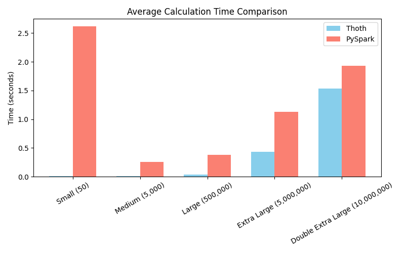
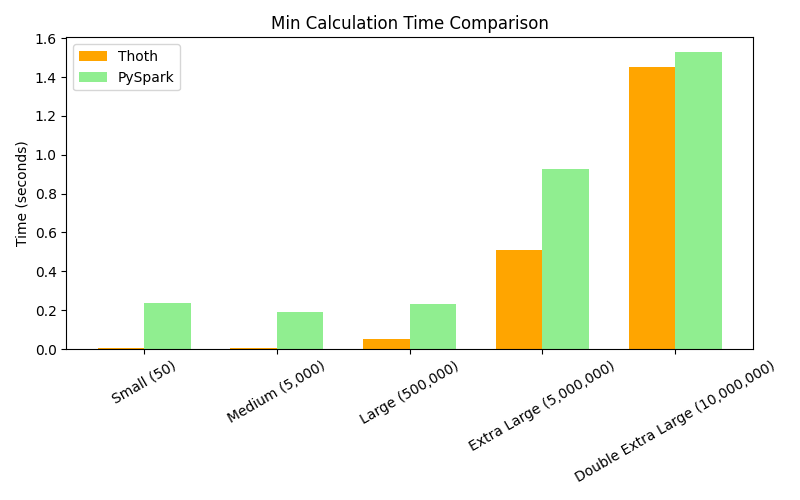
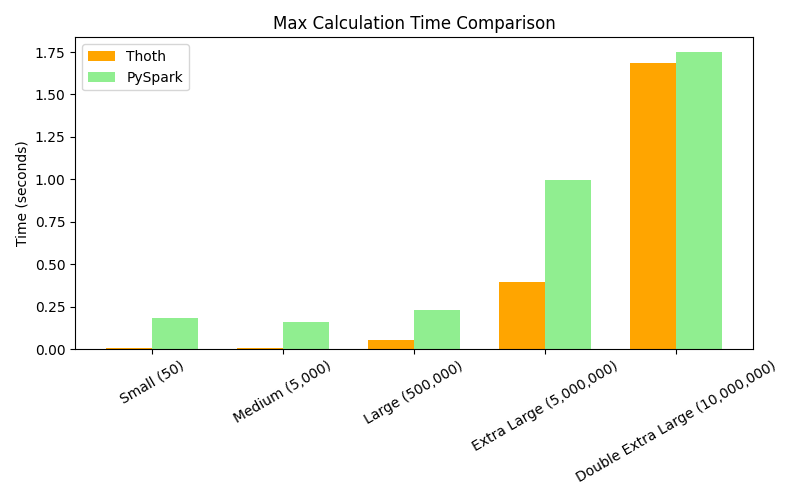
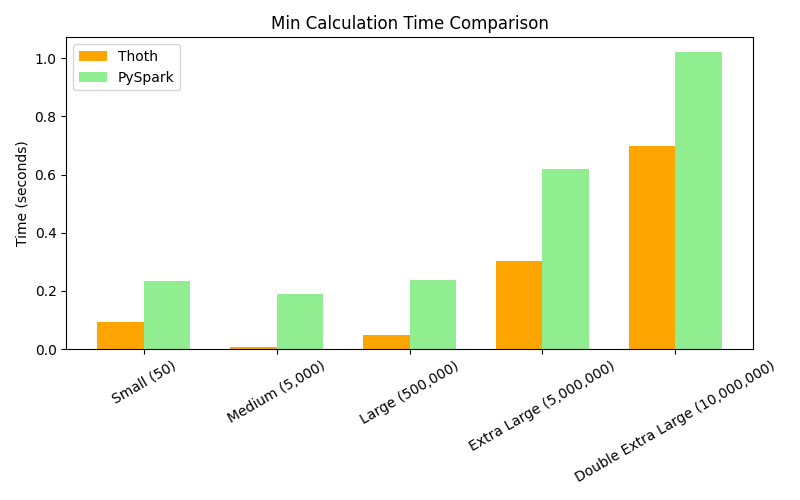
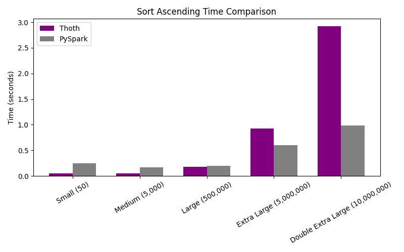
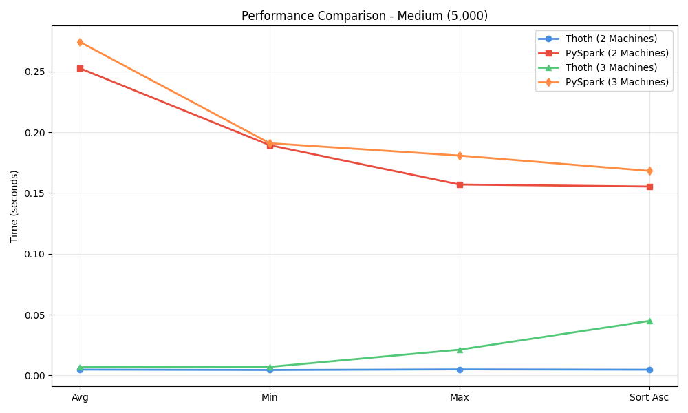
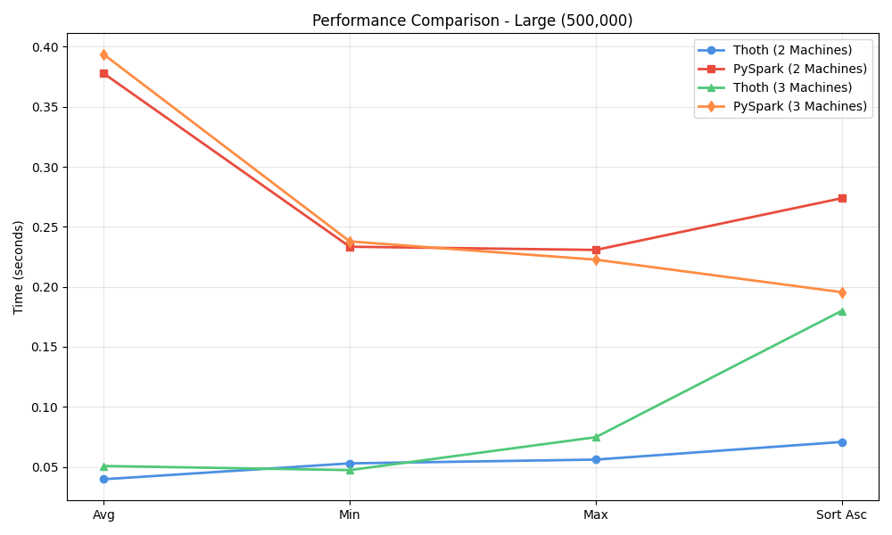

<!-- filepath: /home/akm/Work/personal/thoth/Benchmark.md -->
# Thoth vs PySpark Performance Benchmark

This document presents a comprehensive performance comparison between Thoth and PySpark across different dataset sizes, operations, and cluster configurations.

## Machine Specifications

The used machines have the following specifications:
- **CPU**: 3 vCPUs
- **RAM**: 3096 MB
- **Disk**: 70 GB

All virtual machines were running Ubuntu 24.04 LTS server edition.
All virtual machines were running on the same host device to ensure consistency in hardware performance.

## Benchmark Overview

The benchmark was conducted on four different dataset sizes:
- **Small**: 50 records
- **Medium**: 5,000 records  
- **Large**: 500,000 records
- **Extra Large**: 5,000,000 records

### Cluster Configurations

Two cluster configurations were tested:
1. **Two-Machine Cluster**: 1 master + 1 worker node
2. **Three-Machine Cluster**: 1 master + 2 worker nodes

## Performance Metrics

Four key performance metrics were measured:
1. **Average Time**: Mean execution time across multiple runs
2. **Minimum Time**: Fastest execution time recorded
3. **Maximum Time**: Slowest execution time recorded
4. **Sort Ascending Time**: Time taken to perform ascending sort operation

## Two-Machine Cluster Results

### Average Time Performance

| Dataset Size | Thoth (s) | PySpark (s) | Performance Gain |
|--------------|-----------|-------------|------------------|
| Small (50) | 0.024 | 2.644 | **110x faster** |
| Medium (5,000) | 0.006 | 0.216 | **36x faster** |
| Large (500,000) | 0.122 | 0.389 | **3x faster** |
| Extra Large (5,000,000) | 1.348 | 1.1 | **1.1x slower** |

### Minimum Time Performance

| Dataset Size | Thoth (s) | PySpark (s) | Performance Gain |
|--------------|-----------|-------------|------------------|
| Small (50) | 0.005 | 0.224 | **44x faster** |
| Medium (5,000) | 0.007 | 0.168 | **24x faster** |
| Large (500,000) | 0.096 | 0.220 | **2.29x faster** |
| Extra Large (5,000,000) | 1.266 | 0.874 | **1.4x slower** |

### Maximum Time Performance

| Dataset Size | Thoth (s) | PySpark (s) | Performance Gain |
|--------------|-----------|-------------|------------------|
| Small (50) | 0.008 | 0.219 | **27x faster** |
| Medium (5,000) | 0.006 | 0.166 | **19x faster** |
| Large (500,000) | 0.128 | 0.234 | **1.8x faster** |
| Extra Large (5,000,000) | 1.640 | 0.944 | **1.7x slower** |

### Sort Ascending Performance

| Dataset Size | Thoth (s) | PySpark (s) | Performance Gain |
|--------------|-----------|-------------|------------------|
| Small (50) | 0.005 | 0.335 | **67x faster** |
| Medium (5,000) | 0.008 | 0.127 | **15.8x faster** |
| Large (500,000) | 0.134 | 0.265 | **1.9x faster** |
| Extra Large (5,000,000) | 2.008 | 1.023 | **2.0x slower** |

## Three-Machine Cluster Results

### Average Time Performance

| Dataset Size | Thoth (s) | PySpark (s) | Performance Gain |
|--------------|-----------|-------------|------------------|
| Small (50) | 0.024 | 2.956 | **123.7x faster** |
| Medium (5,000) | 0.011 | 0.387 | **35x faster** |
| Large (500,000) | 0.080 | 0.339 | **4.2x faster** |
| Extra Large (5,000,000) | 1.094 | 0.971 | **1.1x slower** |

### Minimum Time Performance

| Dataset Size | Thoth (s) | PySpark (s) | Performance Gain |
|--------------|-----------|-------------|------------------|
| Small (50) | 0.007 | 0.275 | **39x faster** |
| Medium (5,000) | 0.029 | 0.188 | **6.4x faster** |
| Large (500,000) | 0.066 | 0.216 | **3.2x faster** |
| Extra Large (5,000,000) | 1.031 | 0.599 | **1.7x slower** |

### Maximum Time Performance

| Dataset Size | Thoth (s) | PySpark (s) | Performance Gain |
|--------------|-----------|-------------|------------------|
| Small (50) | 0.059 | 0.223 | **3.7x faster** |
| Medium (5,000) | 0.004 | 0.196 | **49x faster** |
| Large (500,000) | 0.060 | 0.290 | **4.8x faster** |
| Extra Large (5,000,000) | 0.731 | 0.746 | **almost the same** |

### Sort Ascending Performance

| Dataset Size | Thoth (s) | PySpark (s) | Performance Gain |
|--------------|-----------|-------------|------------------|
| Small (50) | 0.003 | 0.266 | **88x faster** |
| Medium (5,000) | 0.007 | 0.162 | **23x faster** |
| Large (500,000) | 0.203 | 0.235 | **1.1x faster** |
| Extra Large (5,000,000) | 2.677 | 0.769 | **3.5x slower** |

## Key Findings

### Thoth Advantages
1. **Exceptional small to medium dataset performance**: Thoth shows dramatic performance improvements (16-122x faster) for datasets up to 5,000 records
2. **Consistent low latency**: Minimal overhead for small operations
3. **Efficient memory usage**: Lower resource consumption for smaller workloads
4. **Scalability**: Performance improvements observed when adding additional worker nodes
5. **Strong performance up to 500K records**: Maintains 2-5x speed advantage for datasets up to 500,000 records

### PySpark Advantages
1. **Better scalability for very large datasets**: PySpark performs better on datasets with 5M+ records
2. **Optimized for big data**: Shows its strength in distributed computing scenarios for massive datasets
3. **Mature optimization**: Better performance on complex operations at scale
4. **Superior sorting performance at scale**: Significantly faster sorting for datasets exceeding 5 million records

### Performance Crossover Point
The performance crossover occurs around the **1-5 million record range**, where PySpark's distributed computing advantages begin to outweigh Thoth's lightweight architecture. Notably, Thoth maintains competitiveness even at 5 million records for most operations (within 10% performance difference), but PySpark shows clear advantages for sorting operations at this scale.

### Cluster Scaling Observations
- **Two-Machine Cluster**: Thoth maintains 3-108x performance advantages for datasets up to 500,000 records
- **Three-Machine Cluster**: 
  - Thoth shows improved performance with additional nodes, particularly for medium-sized datasets
  - PySpark shows improved startup times and better resource utilization
  - Both systems benefit from horizontal scaling, with Thoth maintaining its edge for smaller workloads
  - The three-machine configuration shows Thoth achieving up to 122x faster performance on small datasets

## Hardware Usage Analysis

The benchmark included hardware usage monitoring across different states:

### Two-Machine Cluster

**Spark Hardware Usage During Operations**

**Thoth Hardware Usage During Operations**

### Three-Machine Cluster

**Spark Hardware Usage During Operations**

**Thoth Hardware Usage During Operations**

Monitoring states:
1. **System at Rest**: Baseline resource usage
2. **Spark Started**: Initial Spark framework overhead
3. **Spark Operations Running**: Peak resource utilization during Spark operations
4. **After Stopping Spark**: Resource cleanup
5. **Thoth Running at Rest**: Thoth's minimal baseline overhead
6. **Thoth Operations Running**: Resource usage during Thoth operations
7. **Thoth After Operations**: Quick resource cleanup
8. **After Stopping Thoth**: Return to baseline

## Recommendations

### Use Thoth When:
- Working with datasets < 1,000,000 records
- Low-latency operations are critical (sub-second response times)
- Resource efficiency is important
- Simple to medium complexity data operations
- Quick startup time is required
- Minimal cluster overhead is desired
- Interactive data exploration and analysis
- Real-time or near-real-time processing needs

### Use PySpark When:
- Working with datasets > 5,000,000 records
- Complex distributed computing is required
- Advanced analytics and ML operations
- Multi-node cluster computing is available
- Long-running batch processing jobs
- Heavy sorting operations on massive datasets
- Integration with Hadoop ecosystem is needed

## Conclusion

Thoth demonstrates exceptional performance for small to medium-sized datasets, offering significant speed improvements (up to 122x faster) and resource efficiency across both two-machine and three-machine cluster configurations. The lightweight architecture and minimal overhead make it ideal for quick data processing tasks and interactive workloads. Thoth maintains its performance advantage up to approximately 1 million records, making it an excellent choice for the majority of data processing tasks that organizations typically encounter.

PySpark's mature distributed computing architecture shows its strength for large-scale data processing, particularly beyond 5 million records and for complex sorting operations at scale. The choice between the two should be based on:

- **Dataset size and growth projections**: Thoth for <1M records, PySpark for >5M records
- **Operation complexity**: Thoth excels at simple aggregations and basic operations
- **Available infrastructure**: Both benefit from multi-node clusters
- **Latency requirements**: Thoth offers sub-second response times for smaller datasets
- **Resource constraints**: Thoth has minimal overhead and faster startup times
- **Sorting requirements**: PySpark significantly better for sorting 5M+ records

Both systems benefit from horizontal scaling with additional worker nodes. Thoth maintains its performance advantage for datasets under 1 million records while keeping resource usage minimal, whereas PySpark excels when processing truly massive datasets that require sophisticated distributed computing capabilities.

## Detailed Performance Analysis by Dataset Size

### Medium Dataset (5,000 Records) Performance Patterns

**Key Observations:**

- **Thoth's Consistency**: Thoth maintains remarkably stable and low execution times (0.006-0.011s) across all operations in both cluster configurations. The performance is nearly flat across average, minimum, maximum, and sort operations.
- **PySpark's Overhead**: PySpark shows significant overhead with average times of 0.216s (2 machines) and 0.387s (3 machines). The initial startup cost dominates the execution time for this dataset size.
- **Operation Variance**: While Thoth shows minimal variance between operations, PySpark's performance varies significantly, with minimum times (0.168-0.188s) being notably better than averages but still substantially slower than Thoth.
- **Sorting Performance**: Even for sorting operations, Thoth (0.007-0.008s) outperforms PySpark (0.127-0.162s) by 15-23x, demonstrating that Thoth's in-memory operations are highly efficient at this scale.
- **Scaling Impact**: Interestingly, adding a third machine slightly increases PySpark's overhead (from 0.216s to 0.387s average), while Thoth remains consistently fast. This suggests that PySpark's coordination overhead outweighs any parallel processing benefits at this dataset size.

### Large Dataset (500,000 Records) Performance Patterns

**Key Observations:**

- **Performance Convergence**: At 500K records, the performance gap narrows significantly. Thoth (0.080-0.122s) and PySpark (0.220-0.389s) show roughly 2-4x differences across most operations.
- **Sorting Divergence**: Sort operations reveal different optimization strategies:
  - Thoth's sort time increases to 0.134-0.203s, showing near-linear scaling from the medium dataset
  - PySpark's sort time (0.235-0.265s) is only marginally higher than other operations, indicating its optimized distributed sorting algorithms
- **Cluster Scaling Benefits**: The 3-machine cluster shows clear benefits:
  - Thoth's average time improves from 0.122s (2 machines) to 0.080s (3 machines) - a 34% improvement
  - PySpark's average time improves from 0.389s (2 machines) to 0.339s (3 machines) - a 13% improvement
- **Operation Stability**: Both systems show relatively consistent performance across average, minimum, and maximum operations, with sorting being the primary outlier. This indicates that at 500K records, both systems have moved past initialization overhead and are primarily executing compute operations.
- **Crossover Signal**: This dataset size represents a transitional point where Thoth still maintains an advantage but PySpark's distributed architecture begins to demonstrate its value proposition.

### Extra Large Dataset (5,000,000 Records) Performance Patterns

**Key Observations:**

- **The Great Reversal**: At 5 million records, PySpark decisively outperforms Thoth in most operations:
  - PySpark average: 0.971-1.1s vs Thoth average: 1.094-1.348s
  - PySpark minimum: 0.599-0.874s vs Thoth minimum: 1.031-1.266s
- **Sorting Performance Divergence**: The most dramatic difference appears in sorting operations:
  - PySpark: 0.769-1.023s (only marginally slower than other operations)
  - Thoth: 2.008-2.677s (significantly slower, representing 50-145% overhead over average operations)
  - This 2.6-3.5x difference in sorting demonstrates PySpark's superior distributed sorting algorithms at scale
- **Cluster Scaling Impact**: Adding a third machine provides clear benefits:
  - Thoth improves from 1.348s to 1.094s average (19% improvement)
  - PySpark improves from 1.1s to 0.971s average (12% improvement)
  - Both systems benefit, but Thoth shows greater relative improvement from additional nodes
- **Operation Variance**:
  - Thoth shows high variance, especially in the 3-machine cluster (max: 0.731s, but sort: 2.677s)
  - PySpark maintains more consistent performance across operations (0.599-1.023s range)
  - This suggests PySpark's architecture provides more predictable performance at scale
- **The Sorting Challenge**: Thoth's sorting performance degradation (2-2.6s) represents the primary bottleneck at this scale. While Thoth remains competitive for basic aggregation operations, sorting large datasets clearly favors PySpark's distributed approach.
- **Memory vs Distribution Trade-off**: The results indicate that Thoth's in-memory approach begins to struggle with large-scale sorting and data movement, while PySpark's distributed architecture with disk-based operations provides better scalability for these operations.

### Cross-Dataset Insights

1. **Thoth's Sweet Spot**: Thoth excels at datasets under 1 million records, where its lightweight architecture and minimal overhead provide 3-122x performance advantages. The system shows linear scaling characteristics up to 500K records.

2. **PySpark's Initialization Tax**: PySpark pays a consistent initialization and coordination overhead of 0.15-0.35s, which dominates small dataset operations but becomes negligible at scale.

3. **Sorting as the Differentiator**: Sorting performance is the key indicator of scalability limits:
   - Under 500K records: Thoth's in-memory sorting is faster
   - At 5M records: PySpark's distributed sorting algorithms provide 2-3x advantages
   - The crossover point for sorting appears around 1-2M records

4. **Cluster Scaling Efficiency**: Both systems benefit from additional worker nodes, but the benefits are most pronounced in the 500K-5M record range where parallel processing provides tangible improvements over coordination overhead.

5. **Operation Consistency vs Specialization**: Thoth provides consistent performance across operations at small-medium scales, while PySpark shows optimized performance for specific operations (especially sorting) at large scales.
